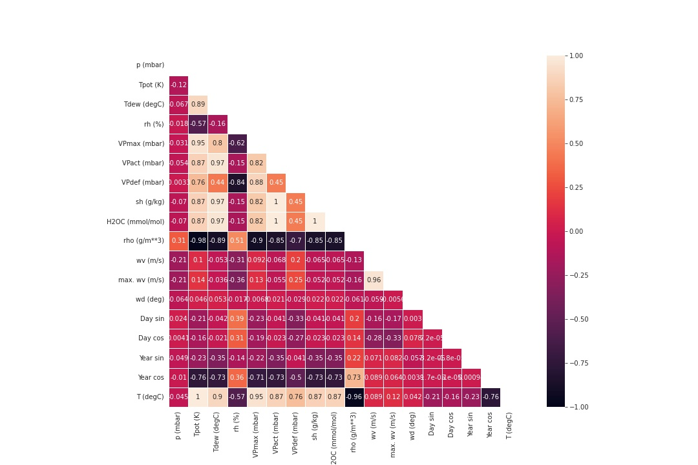

# Weather forecast using LSTM vs Lasso and Light GBM

Prediction analysis has been widely used in real-life business applications. Generalized Linear Models (GLMs) are easy to interpret and deploy, and Gradient Boosting Machines (GBMs) are able to capture the non-linearity among features to generate better results. Given a fair proportion of datasets are in time-series, with a natural dependence on the sequence, it is worth exploring whether Recurrent Neural Networks (RNNs) such as Long Short Term Memory (LSTM) may show any considerable margins of outperformance.

This article is an adaptation of the Tensorflow time series tutorial ([link](https://www.tensorflow.org/tutorials/structured_data/time_series)), where data is sourced from the Max Planck Institute for Biogeochemistry. The dataset contains 14 different features such as air temperature, atmospheric pressure, and humidity, collected every 10 minutes, beginning in 2003.

### Exploratory Data Analysis

This article is an adaptation of the Tensorflow time series tutorial (link), where data is sourced from the Max Planck Institute for Biogeochemistry. The dataset contains 14 different features such as air temperature, atmospheric pressure, and humidity, collected every 10 minutes, beginning in 2003.

For simplicity, the data cleaning and feature engineering primarily follows the work of the original tutorial. The key difference lies in (1) removing features with high correlation with the label eg temperatures in another scale, and (2) prior-step labels are not an input to LSTM, such that the features to LSTM and other models Light GBM and Lasso are the same.

"T (deg C)" is selected to be the label. Note that a number of features have fairly high correlation coefficients with the label, eg close to 1 for "Tpot (K)", which may imply data leakage. For illustration purpose, only the features with correlation coefficients ie between 0.5 and -0.5 are selected for modelling.
Three models are trained and compared: (1) Lasso (base case), (2) Light GBM, and (3) LSTM. Performance metrics: root mean square and Pearson's correlation coefficients.

### Preparing the data for LSTM

The key step in using LSTM is creating the time-series data based on the window size eg looking back for last 7 rows in the dataset. Effectively there is one more dimension in fitting the data into the LSTM model, compared to Lasso or Light GBM, which is based on one row of data. Tensorflow library provided a powerful function (timeseries_dataset_from_array) that makes implementation straightforward.

Parameters for LSTM:
- window size: 7
- number of inputs: 7
- batch size: 32

### Preliminary results of LSTM, Light GBM, Laaso

Based on the preliminary analysis, LSTM is outperforming Light GBM in the test dataset based on the two metrics ie lower RMSE and higher Pearson's Correlation Coefficient. Lasso serves as the base case.

#### RMSE
| Dataset | LSTM | LGB | Lasso |
|--------|------|-----------|-------|
| Test | 5.93  | 6.56 | 7.73 |
| Val | 6.43 | 6.42 | 6.87 |
| Train | 5.68 | 6.80 | 8.08 |

#### Pearson's Correlation Coefficient
| Dataset | LSTM | LGB | Lasso |
|--------|------|-----------|-------|
| Test | 0.67  | 0.62 | 0.34 |
| Val | 0.58 | 0.59 | 0.44 |
| Train | 0.77 | 0.64 | 0.36 |

### Future development
- Application of other time-series data such as stock market prices
- Hyperparamter tuning